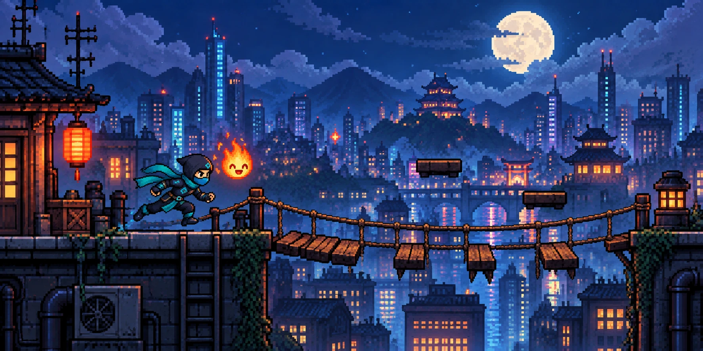
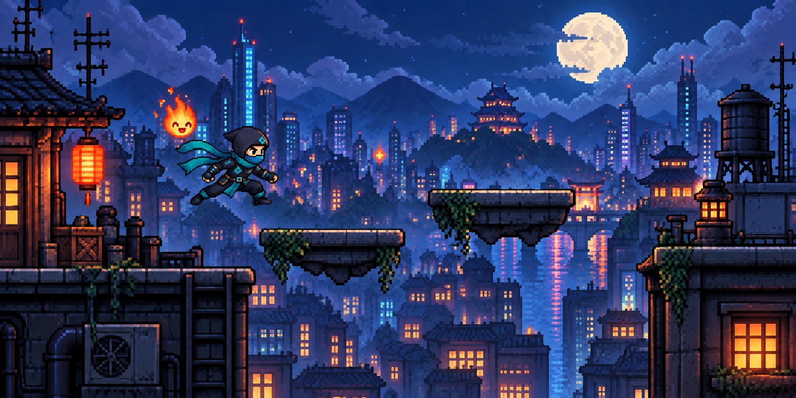
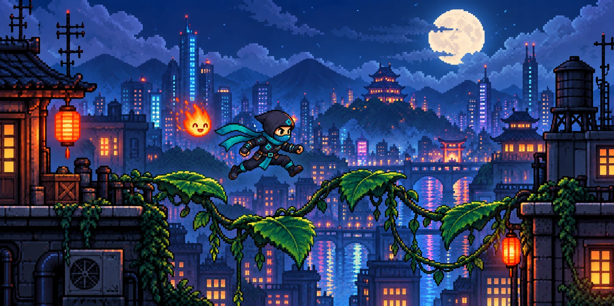
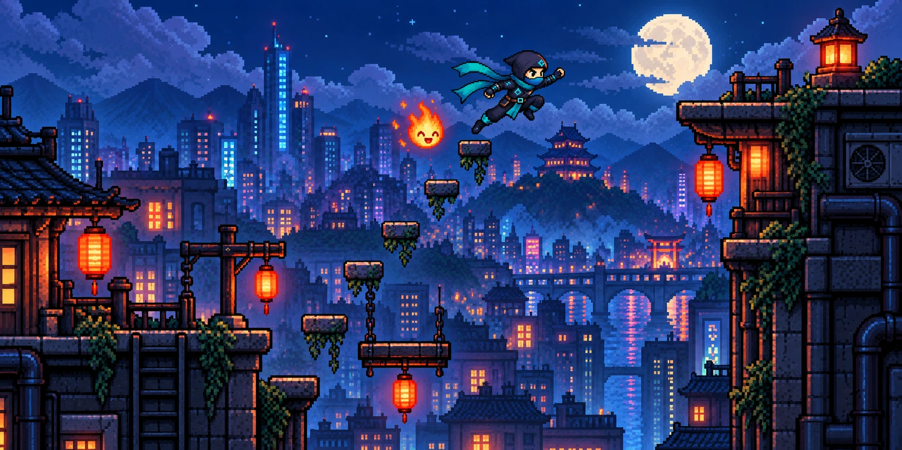
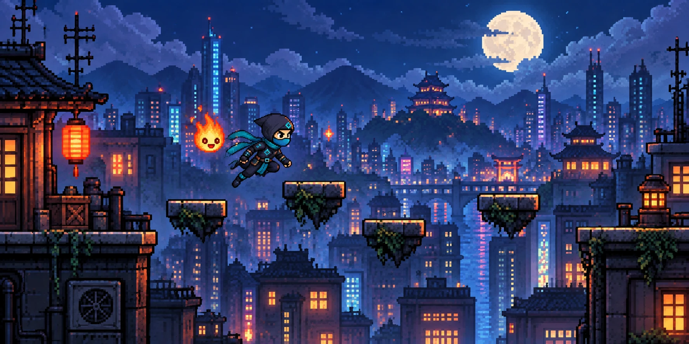

# Ninjaverse

A pixel art exploration and jumping game for the desktop. Guide a little ninja across the rooftops of a moonlit city, with a friendly fireball floating by your side. Jump the gaps in a broken rope bridge, ride floating platforms, keep moving over blocks that crumble under your feet, find your way through a dark stretch where only the fireball's light shows the path (and reveals a false platform), then cross the vine bridge against the wind, where Ember burns away a wall of vines, to reach the far rooftop. Ember calls out tips as you reach each challenge, and if you miss a platform it can carry you back to the ledge (three times per game).

## Concept art



| | |
| --- | --- |
|  |  |
|  |  |

## Controls

| Action | Key |
| --- | --- |
| Run | Left and Right arrows |
| Jump | Up arrow |
| Ninja high jump | Up arrow twice |
| Talk to Ember | T |
| Pause | Esc |

Glowing gold blocks are checkpoints. If you fall, you start again from the last one you reached.

## Ember, your fireball

Press T to talk to Ember. The game freezes while you chat. Ask about the route, whether a block is safe or where to jump, and Ember answers based on what is happening in the game. It can also help: light up the dark stretch, warn you about an unsafe block, burn vines out of your way, slow your fall or carry you to a ledge. Some of this it does on its own, like burning the vines when you reach them or rescuing you when you miss a jump. Ask about anything else and you get a quirky fireball reply instead.

Ember's brain is Nemotron-Mini-4B-Instruct, running on your own computer through Ollama. The model only suggests what to say and do; the game checks every suggestion and only carries out help that is allowed right now.

To switch Ember on, install [Ollama](https://ollama.com), then run:

```console
ollama pull nemotron-mini
```

Without it the game still plays; Ember just tells you its brain is switched off.

## Tech stack

**Frontend**
- React and TypeScript for the screens and game logic
- Vite to run and build the app
- Tailwind CSS for styling
- React Router to move between screens
- Framer Motion for title screen fades
- use-sound for button sounds

**Game**
- Three.js with React Three Fiber to draw the game world in flat 2D
- Drei for keyboard controls

**Pixel art**
- Python with Pillow, NumPy and OpenCV to cut the ninja, the fireball, the platforms and the background out of the concept art (`scripts/build_art.py`)
- Press Start 2P pixel font

**Backend**
- Rust with Tauri 2 to run the game as a desktop app
- reqwest to pass Ember's messages to Ollama

**Ember**
- Nemotron-Mini-4B-Instruct, run locally with Ollama

## Run it

You need Node.js and Rust installed.

```console
npm install
npm run tauri dev
```
