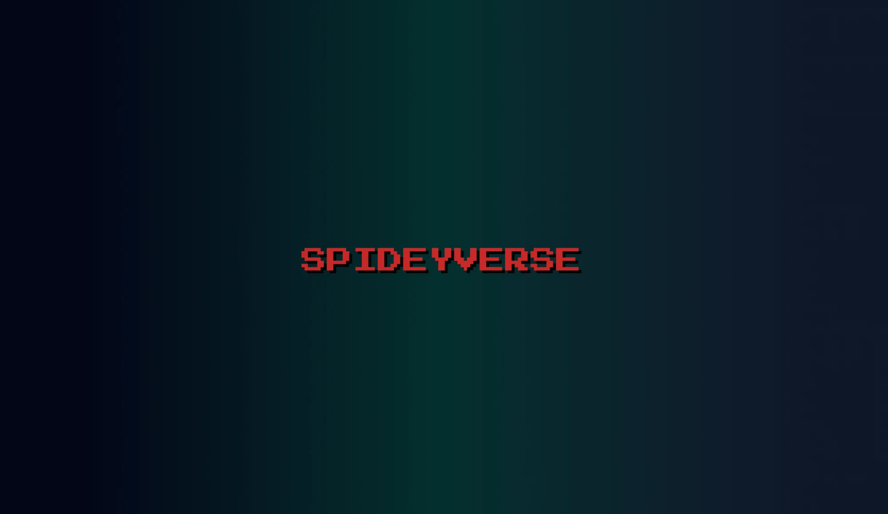
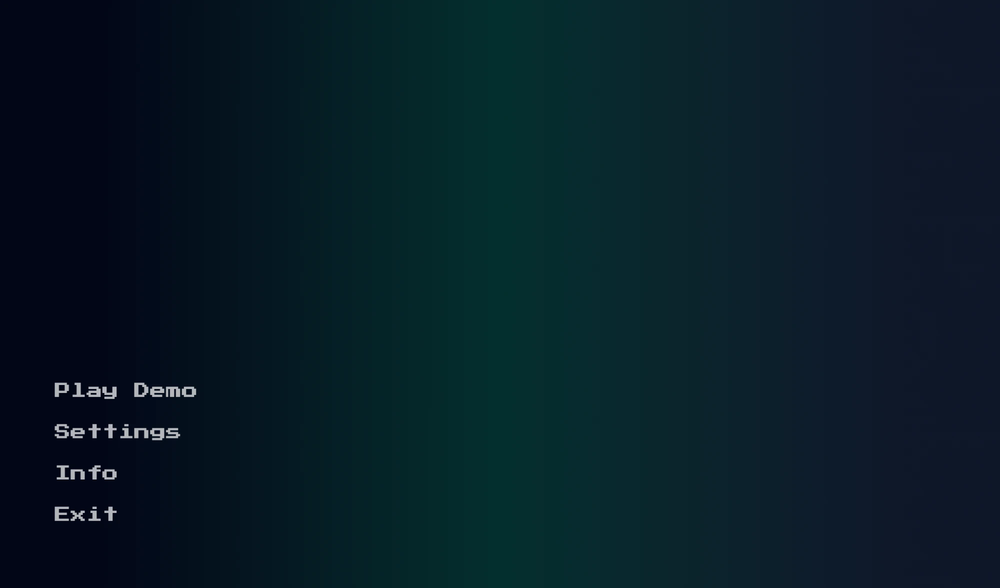
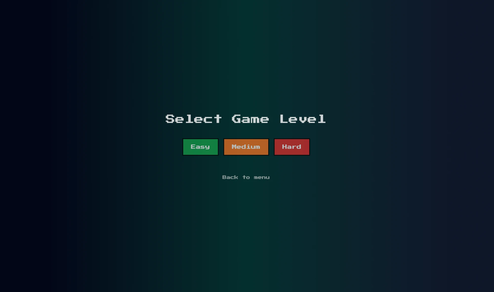
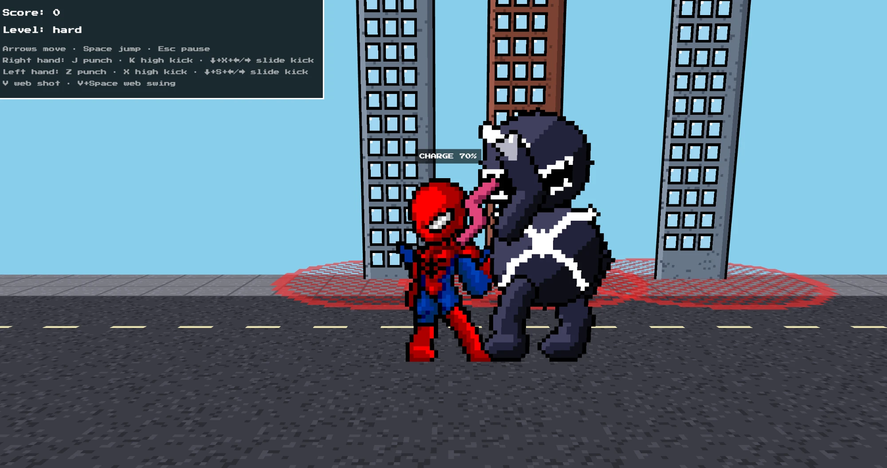
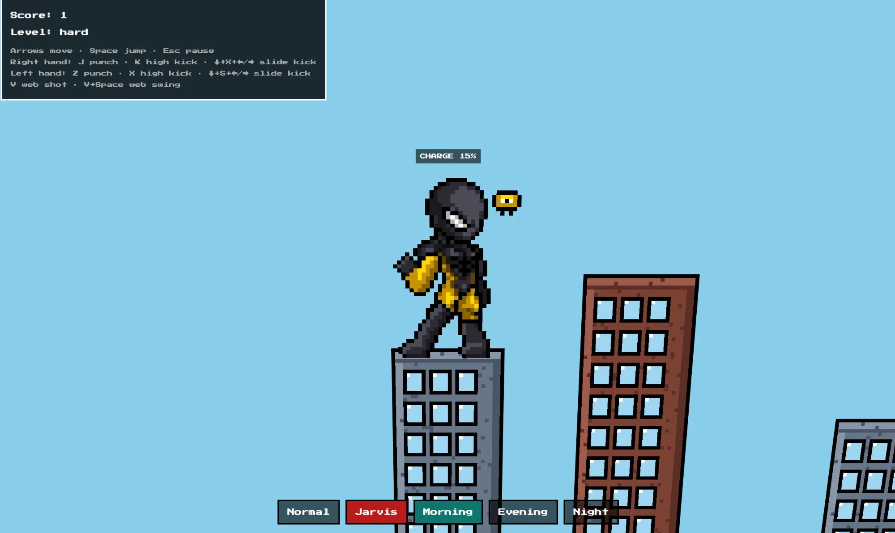

# SpideyVerse

A pixel art Spider-Man game for the desktop. Pick a level, swing across the city on your webs, land on rooftops and fight Venom on the hard level. A helper called Jarvis builds the city layout for each level.



## Screenshots

| Main menu | Level select |
| --- | --- |
|  |  |

**Fighting Venom on the hard level**



**Jarvis suit on a rooftop**



## Controls

| Action | Right hand | Left hand |
| --- | --- | --- |
| Move | Arrow keys | Arrow keys |
| Jump | Space | Space |
| Punch | J | Z |
| High kick | K | X |
| Slide kick | Down + X + Left or Right | Down + S + Left or Right |
| Web shot | V | V |
| Web swing | V + Space | V + Space |
| Pause | Esc | Esc |

## Tech stack

**Frontend**
- React and TypeScript for the screens and game logic
- Vite to run and build the app
- Tailwind CSS for styling
- React Router to move between screens
- Framer Motion for menu fades
- use-sound for button sounds

**Game**
- Three.js with React Three Fiber to draw the game world
- Drei for keyboard controls

**Pixel art**
- Python with Pillow to turn pictures into pixel sprites and to draw every animation frame
- HTML canvas to paint the sprites, buildings and street as crisp pixel textures
- Press Start 2P pixel font

**Backend**
- Rust with Tauri 2 to run the game as a desktop app
- A small Rust level generator (Jarvis) that picks the buildings, villain energy and attack for each level

## Run it

You need Node.js and Rust installed.

```console
npm install
npm run tauri dev
```
